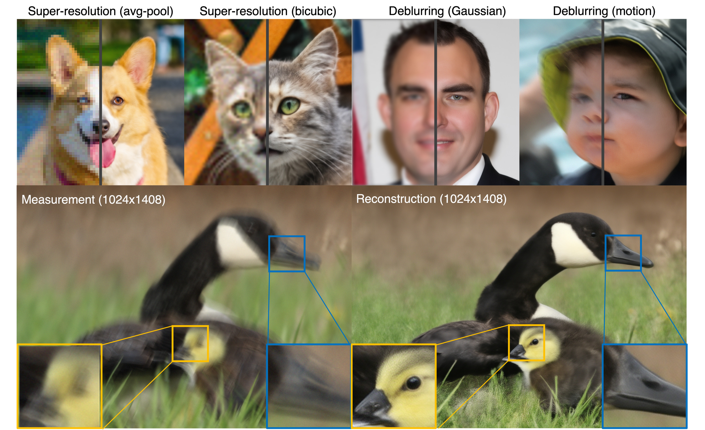

# FlowDPS: Flow-Driven Posterior Sampling for Inverse Problems



## Abstract


❗️Flow matching is a recent state-of-the-art framework for generative modeling based on ordinary differential equations (ODEs). While closely related to diffusion models, __it provides a more general perspective__ on generative modeling. 

❓ Although inverse problem solving has been extensively explored using diffusion models, it has not been rigorously examined within the broader context of flow models. Therefore, __we extend the diffusion inverse solvers (DIS)— which perform posterior sampling by combining a denoising diffusion prior with an likelihood gradient—into the flow framework.__

👍 Our proposed solver, Flow-Driven Posterior Sampling (FlowDPS), can also be seamlessly integrated into a latent flow model with a transformer architecture. Across four linear inverse problems, we confirm that FlowDPS outperforms state-of-the-art alternatives, all without requiring additional training.


## Quick Start

### Environment Setup

First, clone this repository and install requirements.

```
git clone https://github.com/FlowDPS-Inverse/FlowDPS.git
cd FlowDPS
conda env create -f environment.yaml
conda activate flowdps
```

> If you encounter pip error during install, remove pytorch from the envirionment.yaml and manually install using commands at https://pytorch.org/get-started/previous-versions/.


### Examples

You can quickly check the results using following examples.

**Example 1. Super-resolution x 12 (avg-pool) / Dog**
```
python solve.py \
    --img_size 768 \
    --img_path samples/afhq_example.jpg \
    --prompt "a photo of a closed face of a dog" \
    --task sr_avgpool \
    --deg_scale 12 \
    --efficient_memory;
```

**Example 2. Super-resolution x 12 (bicubic) / Animal**
```
python solve.py \
    --img_size 768 \
    --img_path samples/div2k_example.png \
    --prompt "a high quality photo of animal, bush, close-up, fox, grass, green, greenery, hide, panda, red, red panda, stare" \
    --task sr_bicubic \
    --deg_scale 12 \
    --efficient_memory;
```
> The prompt (after "a high quality photo of") is extracted by DAPE from measurement.

**Example 3. Motion Deblur / Human**
```
python solve.py \
    --img_size 768 \
    --img_path samples/ffhq_example.png \
    --prompt "a photo of a closed face" \
    --task deblur_motion \
    --deg_scale 61 \
    --efficient_memory;
```


For each task, expected results are
